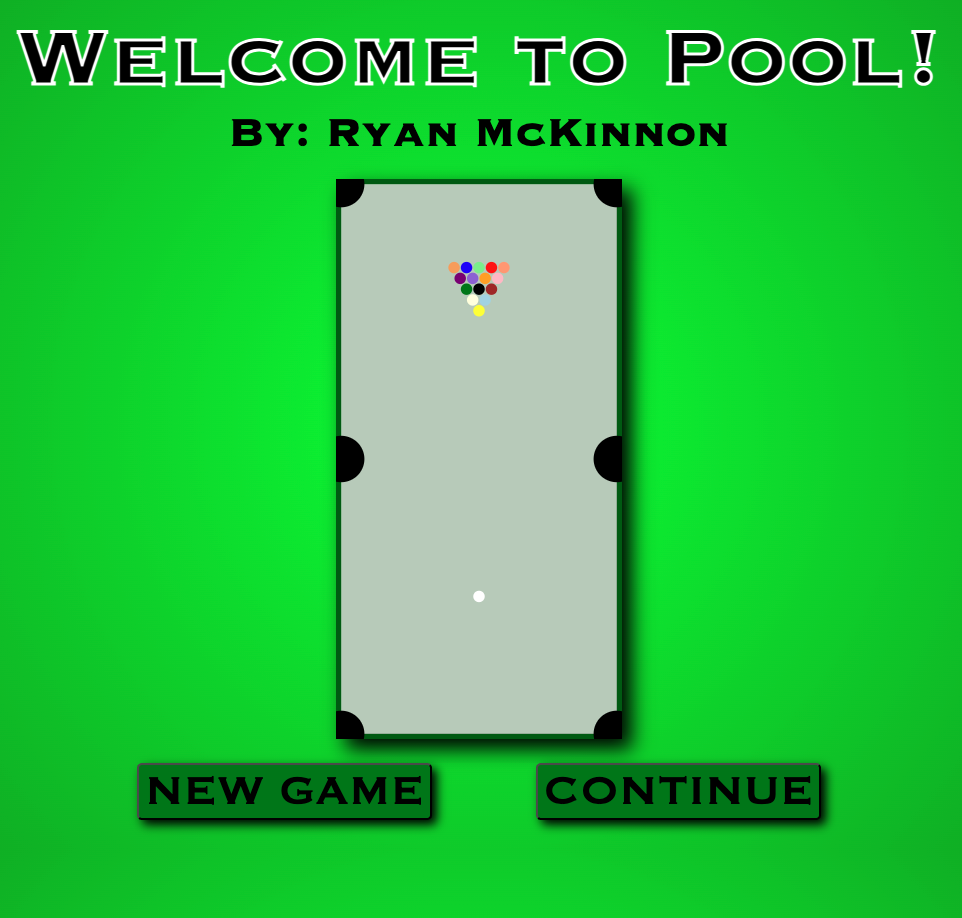
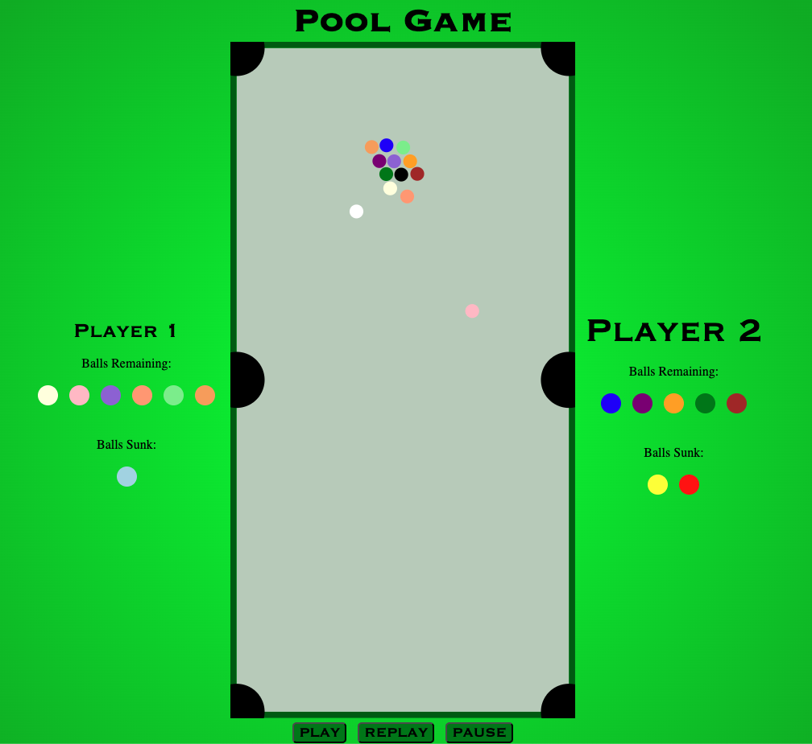

# Billiards
A re-creation of the Billiards game with a top-down perspective. Made by integrating C, Python, SQL, HTML, CSS, and JavaScript. Utilizes the client-server model to send data between Python (the server) and javascript (the client).

## Author
Ryan McKinnon

## Name
SQL Library

## Description
A C-library to mimic SQL functions, as well as add some new ones. Is fully capable of loading existing .db and .sql files, as well as exporting tables into these file formats.

## Running The Program
Run the makefile with 'make' command
Execute the program with 'python3 server.py {localhostnumber}' to run it on a localhost
Navigate to 'https://{localhostnumber}/title.html' in a browser to play the game

## Visuals
Title Screen:

Gameplay Screen:

